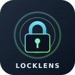

<div align="center">



# LockLens

Inline resolved versions from lock files — one extension, five ecosystems.

**npm** &nbsp;·&nbsp; **yarn** &nbsp;·&nbsp; **pnpm** &nbsp;·&nbsp; **bun** &nbsp;·&nbsp; **composer**

</div>

---

## What it does

LockLens reads your lock file and shows the **actually resolved version** of every declared dependency inline, color-coded by whether a newer version is available on the registry.

```jsonc
{
  "dependencies": {
    "react": "^18.2.0",        → 18.3.1    (green — up to date)
    "postcss": "^8.5.10",      → 8.5.10    (green — up to date)
    "mysql2": "^3.22.0"        → 3.22.0    (red — 3.22.2 on npm)
  }
}
```

Hover over any entry to see the latest registry version, the update drift (`major` / `minor` / `patch`), transitive versions pulled by other packages, and a deep link to the registry page.

## Supported files

| Manifest | Lock files it reads |
|---|---|
| `package.json` | `pnpm-lock.yaml`, `yarn.lock` (classic + Berry), `bun.lock`, `package-lock.json`, `npm-shrinkwrap.json` |
| `composer.json` | `composer.lock` |

Detection priority for Node projects: `pnpm → yarn → bun → npm`.

## Features

- **Resolved versions inline** — picks the highest version from the lockfile when a package has multiple installs.
- **Registry update check** — queries [npmjs.com](https://www.npmjs.com) / [Packagist](https://packagist.org) and color-codes the inline text:
  - 🔴 **Red** — a newer version is available.
  - 🟢 **Green** — the installed version matches the registry latest.
- **Transitive version hover** — if a dependency exists at multiple versions in the lockfile, the hover lists each one and which parent package pulled it (supported for npm, yarn, pnpm).
- **Registry links** — each hover has a deep link pinned to the exact installed version.
- **Manual refresh** — the `LockLens: Refresh resolved versions` command clears the cache and re-fetches.
- **Zero runtime dependencies** — every parser is written from scratch.

## Settings

| Key | Default | Purpose |
|---|---|---|
| `locklens.enabled` | `true` | Show inline versions. |
| `locklens.checkUpdates` | `true` | Query the registry for the latest version. |
| `locklens.colorize` | `true` | Red/green coloring. Turn off for a single neutral color. |
| `locklens.outdatedColor` | `#d64545` | Color when a newer version is available. |
| `locklens.upToDateColor` | `#64a46b` | Color otherwise. |

## Commands

- `LockLens: Refresh resolved versions` — clears the registry cache and re-renders every open manifest.
- `LockLens: Toggle inline versions` — hides/shows annotations for the current session.

## How it works

On opening a `package.json` or `composer.json`, LockLens:

1. Detects the manifest kind.
2. Looks for a sibling lock file in the same directory.
3. Parses it into a map of `name → [versions]` (with parent info where available).
4. Picks the highest version per package and renders it inline.
5. Asynchronously queries the registry for the latest published version; caches it for one hour; updates the decoration color once the response arrives.

All parsing is hand-written and dependency-free.

## Caveats

- Bun's binary `bun.lockb` is not read — generate the text format with Bun 1.2+ (`bun install` writes `bun.lock` by default).
- Registry checks require outbound HTTPS. If you're behind a proxy and annotations stay un-colored, LockLens currently doesn't forward proxy config.
- Workspaces/monorepos: the lock file must live in the same directory as the manifest (or in the root workspace).

## License

MIT
